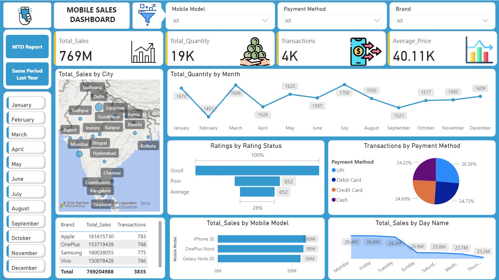

# 📱 Mobile Sales Dashboard – Power BI

## 📌 Overview
The **Mobile Sales Dashboard** is an interactive Power BI dashboard built to analyze mobile phone sales across different cities, brands, payment methods, and time periods. It provides actionable business insights through dynamic visualizations, KPIs, and filters, enabling users to monitor performance and make data-driven decisions.

---

## 🚀 Features
- 📊 Interactive Power BI Dashboard
- 📅 Monthly Sales Analysis
- 🌍 Sales by City (Map Visualization)
- 📱 Sales by Mobile Model
- 🏷️ Sales by Brand
- 💳 Transactions by Payment Method
- ⭐ Customer Rating Analysis
- 📈 Daily & Monthly Sales Trends
- 🎛️ Dynamic Filters and Slicers

---

## 📊 Key Performance Indicators (KPIs)

| KPI | Value |
|------|------:|
| 💰 Total Sales | ₹769M |
| 📦 Total Quantity | 19K |
| 🧾 Total Transactions | 4K |
| 💵 Average Selling Price | ₹40.11K |

---

## 📈 Dashboard Insights

- Generated **₹769 Million** in total sales.
- Sold over **19,000** mobile phones.
- Recorded more than **4,000** successful transactions.
- **UPI** emerged as the most preferred payment method.
- Sales peaked during **March** and **July**.
- Major cities like **Delhi, Mumbai, Hyderabad, Bengaluru, Chennai, and Kolkata** contributed significantly to revenue.
- **Apple, Samsung, OnePlus, and Vivo** were among the highest-performing brands.
- Customer feedback indicates a high percentage of **Good** ratings.

---

## 🛠️ Tools & Technologies

- Power BI Desktop
- Power Query
- DAX (Data Analysis Expressions)
- Microsoft Excel
- Bing Maps
- Data Modeling
- Data Visualization

---

## 📂 Dashboard Components

- KPI Cards
- Sales by City (Map)
- Monthly Quantity Trend
- Sales by Mobile Model
- Sales by Brand
- Payment Method Analysis
- Customer Rating Analysis
- Sales by Day
- Interactive Slicers

---

## 📸 Dashboard Preview



---

## 📁 Project Structure

```text
Mobile-Sales-Dashboard/
│── Dashboard.pbix
│── Dashboard.jpg
│── Mobile_Sales_Data.xlsx
│── README.md
```

---

## 🎯 Skills Demonstrated

- Data Cleaning
- Data Transformation
- Data Modeling
- DAX Calculations
- KPI Design
- Business Intelligence
- Dashboard Development
- Interactive Reporting
- Data Visualization

---

## 📌 Business Value

This dashboard enables businesses to:

- Track overall sales performance.
- Identify top-performing brands and products.
- Analyze customer purchasing behavior.
- Compare monthly sales trends.
- Monitor preferred payment methods.
- Support strategic business decisions using real-time insights.

---

## 👨‍💻 Author

**Anish Poswal**

---

## ⭐ Support

If you found this project helpful, please consider giving it a **⭐ Star** on GitHub!
